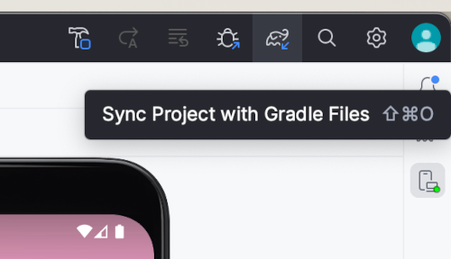
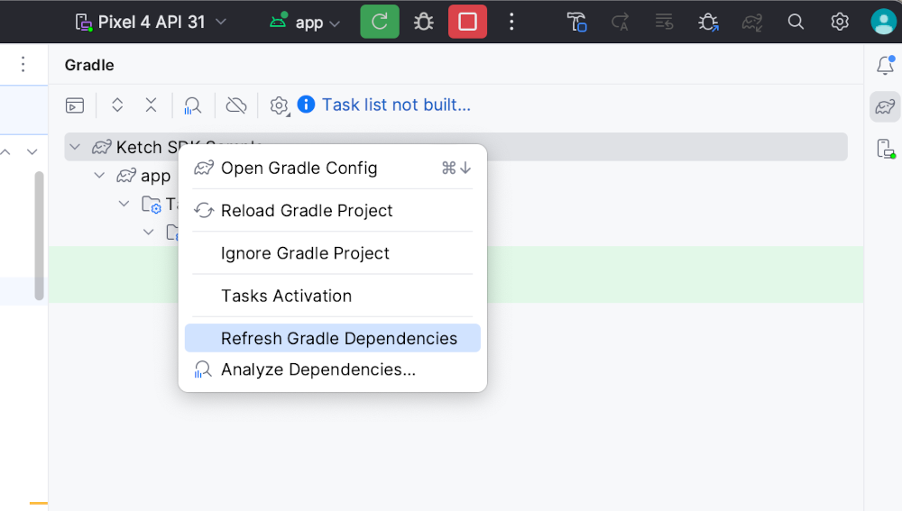

# Ketch Android SDK Sample App

## Prerequisites

- Install [Android Studio](https://developer.android.com/studio) and a Android emulator

## Quick Guide

### Step 1. Clone the repository

```
git clone git@github.com:ketch-sdk/ketch-samples.git
cd "ketch-android/sdk/ketch-android-sample"
```

### Step 2. Run the app in Android Studio

Open the project directory `Android Native SDK Sample` in the Android Studio.

Click Run to build and run the app on the simulator or a physical device.

### (Optional) Step 3. Use your own Ketch organization and property

By default, this sample application is connected to an existing Ketch organization with preconfigured settings.

To use your own organization and property, modify the `init()` function within
[`MainActivity.kt`](./app/src/main/java/com/ketch/sample/MainActivity.kt#L274-283) as follows:

```kotlin
companion object {

    // ...

    private const val ORG_CODE = "your_organization_code"
    private const val PROPERTY = "your_property_code"
    private const val ADVERTISING_ID_CODE = "your_identity_name"  // e.g. "aaid"

    // ...
}
```

### Updating the Sample App to the latest version of Ketch Android SDK

1. Clean the project by "Build" => "Clean Project"

2. (optional) Sync project from Gradle build files.



3. Refresh Gradle Dependencies



### Updating the Sample App to the development branch of Ketch Android SDK

0. Make sure you have the development branch of the Ketch Android SDK built on https://jitpack.io/. If you don't have it, please push the branch and make sure the build is triggered for **ketch-com/ketch-android** repository.
1. Open the `ketch-android-sampe/app/build.gradle` file.
2. Change the dependency to the development branch of the Ketch Android SDK.

```gradle
-    implementation 'com.github.ketch-com:ketch-android:main-SNAPSHOT'
+    implementation 'com.github.ketch-com:ketch-android:your-development-branch-name'
```

3. Sync the Gradle project and [make sure the dependency was successfully loaded](#updating-the-sample-app-to-the-latest-version-of-ketch-android-sdk).
