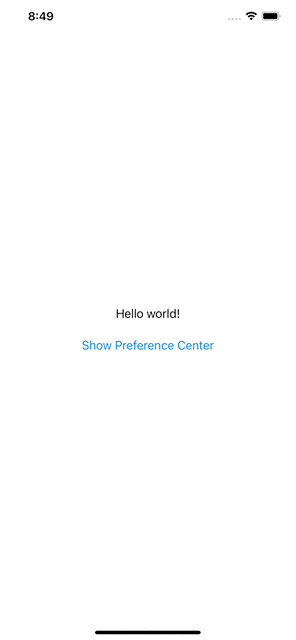

# Using the Ketch Smart Tag within a SwiftUI based Swift project

This example demonstrates how you can use the Ketch Smart Tag within a SwiftUI based iOS application to display the preferences view. It also shows how to pass in an identity and add it to the dataLayer to be picked up by the Ketch Smart Tag.

The example utilizes an HTML page embedded into the application, but can easily be substituted to display a similar page hosted on a website. To display the page in the iOS app, it utilizes the WebKit WebView from the WebKit framework.



## Prerequisites
- A property configured and deployed within the Ketch Platform.
- A [custom identity space configured on the deployed property](https://docs.ketch.com/hc/en-us/articles/360063594173-Managing-Properties#configuring-data-layer-setup-0-9) to read it's value from the `dataLayer`.

## Getting Started

To get going, open your SwiftUI based iOS project, or create a new one.

Next, we'll add a new file with the `Empty` template and name it `index.html`.

Inside the `index.html` file, add a standard webpage structure like below and set the `viewport` size for the page.

```html
<html>
    <head>
        <meta name="viewport" content="width=device-width, initial-scale=1">
    </head>
    <body></body>
</html>
```

We'll be adding 3 scripts to the `head` of our page to do the following:
- Add the identities passed in through the query parameters to the `dataLayer`
- Load the Ketch Smart Tag
- Create a custom plugin to show the Ketch Preference Center and respond to the closing of the Ketch Preference Center

### Add identities to the `dataLayer`
The identities will be passed to the page through the query parameters of the URL. Once we have the identities, then we need to add them to the dataLayer, creating it first if it does not already exist. Add the following script to the `head` of the `index.html` page below the `<meta>` tag.

```html
<head>
    ...
    <script>
        //get query parameters
        let params = (new URL(document.location)).searchParams;
        let visitorIdValue = params.get("visitorId");
        
        //add identities to dataLayer
        window.dataLayer = window.dataLayer || [];
        window.dataLayer.push({visitorId: visitorIdValue});
      
        // Add multiple identities
        //params.foreach((value, key) => {
        //    window.dataLayer.push({key: value});
        //}   
    </script>
    ...
</head>
```

In this example, we are expecting a `visitorId` to be passed in through the query parameters. This ID could be any identifier used to identify the user using the mobile app. It should also correspond to the identifier setup within the deployed Ketch Property on the Ketch Platform. 

## Load the Ketch Smart Tag
Next, load the Ketch Smart Tag onto the page. This script can be obtained by [exporting it from the Ketch Property page](https://docs.ketch.com/hc/en-us/articles/360062451394-Tag-Implementation).

It should look similar to the `script` below, except it will contain your organizations code and the corresponding property code.

```html
    <script>!function(){var e=document.createElement("script");e.type="text/javascript",e.src="https://global.ketchcdn.com/web/v1/config/org_code/property_code/boot.js",e.defer=e.async=!0,document.getElementsByTagName("head")[0].appendChild(e),window.semaphore=window.semaphore||[]}();</script>
```

_note: the Ketch Smart Tag script should be loaded ***AFTER*** the population of the identitied in the `dataLayer` this will ensure the Ketch Smart Tag will load the users previous consent choices. Providing a cohesive experience with your brand across their various platforms (web, mobile, etc.)_

### Create the custom plugin
Finally, we'll need to create a custom plugin to show and listen for the closing of the Ketch Preference Center.

When the Ketch Preference Center experience closes, the `experienceHidden` event is fired. The event will pass a reason for the experience being closed. The reason will either be a string containing the value `setConsent`, if a submit button was pressed, or a `MouseEvent`, indicating an exit button was pressed indicating the user did not want to save their choices.

To communicate back to the iOS application, the `script` below makes use of `WebKit Message Handlers`. 

_note: If you name your message handler something other than `iosListener` within your iOS app, ensure update the calls below, otherwise messages sent from this script will not be received in your iOS app._

```html
<html>
    <head>
        ...
        <script>
            // Show the preference center experience
            window.semaphore.push(['showPreferences'])
            
            // Custom plugin to listen for the closing of the preference center experience
            var custom_plugin = {
                'init': function(host) {
                    window.webkit.messageHandlers.iosListener.postMessage('custom plugin initialized');
                },
                'experienceHidden': function(host, config, reason) {
                    if ((reason.constructor.name === 'String' && reason === 'setConsent') || reason.constructor.name === 'MouseEvent') {
                        window.webkit.messageHandlers.iosListener.postMessage('PreferenceCenterClosed');
                    }
                }
            }
            
            // Register the custom plugin with the Ketch Smart Tag
            window.semaphore = window.semaphore || [];
            window.semaphore.push(['registerPlugin', custom_plugin]);
        </script>
        ...
    </head>
</html>
```

## Showing the HTML page in an IOS app

With the `index.html` page created, it's time to show it within an iOS application. 

To show our page, we'll utilize `WKWebView` from the WebKit Framework.

To get started, open your application in Xcode, or create a new SwiftUI application.

- Add a new file to the project, template `SwiftUI View`, name it `PreferenceView`.

- Import the `WebKit` framework
```swift
import WebKit
```

- Add another struct to contain the `WebView` which will display our page. This new struct should inherit from `UIViewRepresentable`.
```swift
struct WebView: UIViewRepresentable {

}
```

- Add a variable to take in the name of the HTML page to load.
```swift
struct WebView: UIViewRepresentable {
    let htmlFileName: String
}
```

- Implement the 2 required functions: `makeUIView` and `updateUIView`
```swift
func makeUIView(context: Context) -> some UIView {
}

func updateUIView(_ uiView: UIViewType, context: Context) {
}
```

- In the `makeUIView` function, create the `WKWebView` instance and configure it with the ability to execute the JavaScript on the `index.html` page.
```swift
func makeUIView(context: Context) -> some UIView {
    let preferences = WKWebpagePreferences()
    preferences.allowsContentJavaScript = true
    
    let configuration = WKWebViewConfiguration()
    configuration.defaultWebpagePreferences = preferences

    let webView = WKWebView(frame: .zero, configuration: configuration)
    return webView
}
```

- In the `updateUIView` function, get the URL for the HTML page passed in to the view and load it in to the WebView.
```swift
func updateUIView(_ uiView: UIViewType, context: Context) {
    let wv = uiView as? WKWebView
    var url = Bundle.main.url(forResource: htmlFileName, withExtension: "html")!    
    wv?.load(URLRequest(url: url))
}
```

- In the `PreferenceView` struct, replace the existing code with the code below, passing in the name of the HTML file created earlier.
```swift
struct PreferenceView: View {
    var body: some View {
        WebView(htmlFileName: "index")
    }
}
```

- In the View where you want to show show the `PreferenceView`, add a button which will trigger the showing of the `PreferenceView`. In our example, we will show the `PreferenceView` as a popover.
```swift
struct ContentView: View {
    @State private var showingPopover = false
    var body: some View {
        Text("Hello world!")
            .padding()
        Button("Show Preference Center") {
            showingPopover = true
        }
        .popover(isPresented: $showingPopover) {
            PreferenceView()
        }
    }
}
```

When we test our app, it will now show our HTML page, which will in turn show the Ketch Preference Center for our organization.

## Closing the View when the Preference Center Experience closes

Now that our app shows the Ketch Preference Center, the `PreferenceView` should automatically close when the user submits consent changes or closes the experience. To do this, we'll need to add a message handler to the `WebView` to receive the message from the HTML page to close the view.

- Back in the `PreferenceView` struct, add a new class which inherits from `WKScriptMessageHandler` and `NSObject`, and implement the required function `userContentController`.
```swift
struct WebView: UIViewRepresentable {
    ...
    
    class MessageHandler: NSObject, WKScriptMessageHandler {
        func userContentController(_ userContentController: WKUserContentController, didReceive message: WKScriptMessage) {
        }
    }
}
``` 

- Next check the message received to see if it indicates the user has closed the Ketch Preference Center. In our example, the string we expect to receive is `PreferenceCenterClosed` which corresponds to what we have setup in our custom plugin on our HTML page.
```swift
struct WebView: UIViewRepresentable {
    ...
    
    class MessageHandler: NSObject, WKScriptMessageHandler {
        func userContentController(_ userContentController: WKUserContentController, didReceive message: WKScriptMessage) {
            if (message.body as! String == "PreferenceCenterClosed") {
            }
        }
    }
}
```

- Then add a bindable parameter (`isPresented` in our example) in the `WebView` struct and `MessageHandler` class, as well as an initalizer to set the variable in the `MessageHandler` class.
``` swift
struct WebView: UIViewRepresentable {
    @Binding var isPresented: Bool

    ...
    
    class MessageHandler: NSObject, WKScriptMessageHandler {
        @Binding var isPresented: Bool

        init(isPresented: Binding<Bool>) {
            self._isPresented = isPresented
        }

        func userContentController(_ userContentController: WKUserContentController, didReceive message: WKScriptMessage) {
            if (message.body as! String == "PreferenceCenterClosed") {
                isPresented = false;
            }
        }
    }
}
```

- Update the `PreferenceView` struct to receive and pass along the `isPresented` parameter.
```swift
struct PreferenceView: View {
    @Binding var isPresented: Bool
    var body: some View {
        WebView(isPresented:$isPresented, htmlFileName: "index")
    }
}
```

- Finally, update the view that is using `PreferenceView` to pass along the `isPresented` parameter.
```swift
struct ContentView: View {
    @State private var showingPopover = false
    var body: some View {
        Text("Hello world!")
            .padding()
        Button("Show Preference Center") {
            showingPopover = true
        }
        .popover(isPresented: $showingPopover) {
            PreferenceView(isPresented: $showingPopover)
        }
    }
}
```

Now when you test your app, the page should close upon the user clicking the `Submit` button, or the `Exit` button.

## Passing identities

To ensure the customer's consent choices move with them no matter what device they use to interact with your brand, we can send identity information already present in the app to the Ketch Smart Tag running on the HTML page.

The HTML page we created earlier is already expecting and checking for identity information in query parameters of the URL. So, now all we need to do is inject these identities into the `PreferenceView` and append them to our URL.

- First, open the `PreferenceView` and add a new struct to for the identities to add to the dataLayer.
```swift
struct Identity {
    let code: String
    let value: String
}
```

- Next, add an bindable array variable to the `WebView` struct to receive 1 to many identities.
```swift
struct WebView: UIViewRepresentable {
    @Binding var isPresented: Bool
    @Binding var identities: [Identity]
    let htmlFileName: String

    ...

}
```

- Then at the bottom of the file, create an extension method to add a query parameter to an existing url.
```swift
extension URL {

    func appending(_ queryItem: String, value: String?) -> URL {
        guard var urlComponents = URLComponents(string: absoluteString) else { return absoluteURL }
        var queryItems: [URLQueryItem] = urlComponents.queryItems ??  []
        let queryItem = URLQueryItem(name: queryItem, value: value)
        queryItems.append(queryItem)
        urlComponents.queryItems = queryItems
        return urlComponents.url!
    }
}
```

- Update the `updateUIView` function on the `WebView` struct to iterate over the array of identities and add them to the HTML page's URL.
```swift
struct WebView: UIViewRepresentable {

    ...

    func updateUIView(_ uiView: UIViewType, context: Context) {
        let wv = uiView as? WKWebView
        var url = Bundle.main.url(forResource: htmlFileName, withExtension: "html")!
        for identity in identities {
            url = url.appending(identity.code, value: identity.value)
        }
        wv?.load(URLRequest(url: url))
    }

    ...
}
```

- Then add a bindable array to the `PreferenceView` struct to receive and pass along the identities to the `WebView`.
```swift
struct PreferenceView: View {
    @Binding var isPresented: Bool
    @Binding var identities: [Identity]
    var body: some View {
        WebView(isPresented: $isPresented, identities: $identities, htmlFileName: "index")
    }
}
```

- Return to the view using `PreferenceView`, create a state array containing the identities to use with the Ketch Preference Center, and pass the identities array into `PreferenceView`.
```swift
struct ContentView: View {
    @State private var showingPopover = false
    @State private var ids = [Identity(code: "visitorId", value: "user@test.com")]
    var body: some View {
        Text("Hello world!")
            .padding()
        Button("Show Preference Center") {
            showingPopover = true
        }
        .popover(isPresented: $showingPopover) {
            PreferenceView(isPresented: $showingPopover, identities: $ids)
        }
    }
}
```

Now when you test your application and have set a consent state, you will be able to search the Ketch Audit Logs by the identity your passing through to the `dataLayer` within the HTML page.
